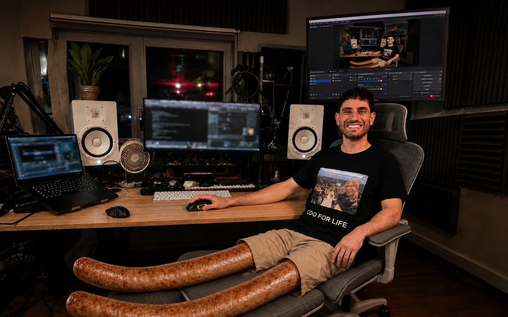

# Ethan’s setup

[Explore my setup](https://ethansk.github.io/ethan-setup/) · [Agentic Mouse](https://ethansk.github.io/agentic-mouse/) · [LinkedIn](https://www.linkedin.com/in/ethansk/)

My desk, apps and mouse controls for working with agents, recording and making music.



## Review code without moving your hand

I use twelve thumb controls mirrored across a right-handed Corsair and a left-handed Razer. High sensitivity keeps hand movement small; I can switch hands or occasionally use both to work through a review faster.

In Better Git VS Code, a quick press of button **5 or 8** jumps to the previous or next change. Hold for 300 ms and release to stage the current file and jump in that direction. The button under the scroll wheel starts VoiceInk++ dictation; the YouTube bridge pauses my video while I talk and resumes only a video it paused.

The website lets you try those controls and the app’s HUD without installing anything. All actions stay in the demo.

## Look around

- Scroll down to zoom in and up to zoom out; drag the background to move around. Spread two fingers to zoom in and pinch them together to zoom out.
- Click a mouse, screen or hardware label to move closer and open it. Edge arrows point to items outside the view.
- Rotate product models by dragging. Use arrow keys to rotate and Home to reset.
- Click outside a dialog or press Escape to return to the room.
- Open the Dell for the interactive desktop, Dock, menu bar and Codex example. Open the Samsung for the silent OBS recording demo.
- Open **Everything I use** for the hardware, apps, public skills and project links.

The room is a photograph with a Three.js camera, not a scan of the entire room. The sausage legs are intentional. Product models are reference-based illustrations, not manufacturer CAD or dimensionally certified replicas.

## On my desk

| Hardware | My model |
| --- | --- |
| [Corsair Scimitar Elite Wireless SE](https://www.corsair.com/uk/en/p/gaming-mouse/ch-9314415-ww/scimitar-elite-wireless-se-mmo-gaming-mouse-black-yellow-ch-9314415-ww) | Right-handed · 12 thumb buttons · Black / yellow |
| [Razer Naga Left-Handed Edition](https://www.razer.com/gb-en/gaming-mice/razer-naga-left-handed-edition) | Left-handed · 12 mirrored controls · Black |
| [MacBook Pro](https://www.apple.com/uk/macbook-pro/) | 16-inch · M5 Max · 64 GB unified memory |
| [Yamaha HS8](https://usa.yamaha.com/products/proaudio/speakers/hs_series/) | White pair · 8-inch studio monitors |
| [Focusrite Scarlett 18i8](https://us.focusrite.com/products/scarlett-18i8-3rd-gen) | 3rd generation · 18 inputs / 8 outputs |
| [Pioneer DDJ-FLX4](https://www.pioneerdj.com/en/product/dj-controllers/ddj-flx4/) | Black · 2-channel DJ controller |
| [Mac mini](https://www.apple.com/uk/mac-mini/) | Under the left speaker |
| [Akai MPK mini Plus](https://www.akaipro.com/discover/mpk) | 37 keys · 8 MPC pads |
| [Shure SM7B](https://www.shure.com/en-GB/products/microphones/sm7b) | Dynamic microphone · Dictation and recording |
| [Dell S3422DW](https://www.dell.com/support/home/en-uk/product-support/product/dell-s3422dw-monitor/overview) | 34-inch · 3440 × 1440 · Curved ultrawide |
| [Samsung S80UA](https://www.samsung.com/pt/monitors/high-resolution/s80ua-27-inch-ips-uhd-4k-ls27a800ujpxen/) | 27-inch · 4K · S27A800U |
| [Mackie Big Knob Passive](https://mackie.com/en/products/accessories/big_knob_passive.html) | Passive monitor controller · Volume / mono / mute / dim |
| [WD Elements Desktop](https://www.westerndigital.com/products/external-drives/wd-elements-desktop-usb-3-0-hdd?sku=WDBWLG0140HBK-EESN) | 14 TB · Black · USB 3.0 |
| [FlexiSpot E7 Pro](https://flexispot.co.uk/next-generation-standing-desk-e7-pro) | 2025 model · Bamboo · 180 × 80 cm · Black frame |
| [Hbada E3 Pro](https://www.hbada.uk/products/hbada-e3-pro-ergonomic-office-chair?variant=57072259858807) | 2026 edition · Grey · With footrest |

The Mac mini’s generation is unconfirmed. The Dell S3422DW identification comes from an earlier display inventory; the Samsung reports LS27A800U, with its full regional SKU unconfirmed. The Amazon order confirms **14 TB**, despite my initially calling it 12 TB. Product links identify the hardware; availability and offered variants can change. [Source notes](SOURCES.md) explain the evidence and remaining uncertainty.

## Apps and skills

Start with [Agentic Mouse](https://github.com/EthanSK/agentic-mouse), [VoiceInk++](https://ethansk.github.io/VoiceInkPlusPlus/), [Better Git VS Code](https://github.com/EthanSK/better-git-vscode), [OBS++](https://github.com/EthanSK/obs-plus-plus), and [Response Preferences](https://ethansk.github.io/response-preferences/).

The full app directory comes from the public [response-preferences desktop inventory](https://ethansk.github.io/response-preferences/desktop/apps.json). The site also links my commonly used public skills and AIMVS development tools. Each project has its own setup instructions; this repository does not install or configure the native apps.

## Run locally

Requires Python 3.10+ and Node.js 22+ for checks; no npm packages or native app build are needed.

```sh
python3 scripts/build.py
python3 scripts/check.py
python3 -m http.server 8842 --bind 127.0.0.1 --directory .build/site
```

Open [localhost:8842](http://127.0.0.1:8842/). Rebuild after editing `docs/`, then reload the browser. GitHub Pages serves the generated `.build/site` artifact.

## Update the setup

- **Hardware and hotspot positions:** edit `docs/gear.json`; coordinates run from 0 to 1 across the room image. Keep this README’s inventory consistent.
- **Room and interactions:** `docs/index.html`, `docs/beta.css` and `docs/beta.mjs`.
- **Share preview:** `docs/assets/sausage-legs-social.jpg` uses the original sausage-leg photo; Open Graph and large-image card metadata in `docs/index.html` point to that image. Keep its dimensions and alt text in sync when replacing it.
- **Product geometry:** `docs/product-models.mjs`; reference notes are in `PRODUCT-MODELS.md`.
- **OBS example:** `docs/obs.html`, `docs/obs.css` and `docs/obs.mjs`.
- **Mouse modes, HUD, mouse models or icon:** change the canonical Agentic Mouse repository, publish it, then run `python3 scripts/sync-sources.py` here. The published native export chooses the source commit; this site does not maintain another button map.
- **Desktop, Dock or apps:** change the response-preferences public demo. The Dell embeds that site directly; the sync script refreshes this site’s app directory.

`sources.lock.json` records the actual source revision and file hashes. A daily GitHub Actions run refreshes the published mouse runtime and app directory, checks the result, saves changes and deploys them. Manual workflow dispatch does the same. Ordinary pushes build the committed snapshot. An upstream refresh that fails checks stops before deployment.

Before pushing a UI change, manually test the final build in Chromium: enter, wheel both ways, drag and release, pinch with two touch points, edge arrows, dialogs, models, both mice, code review, dictation, desktop and OBS. Check a narrow mobile viewport, keyboard controls, reduced motion and browser errors. Automated checks do not prove visual quality or touch behavior.

[AGENTS.md](AGENTS.md) describes ownership and verification requirements for agents. [SOURCES.md](SOURCES.md) covers provenance, privacy and licensing.

## Privacy and reuse

The screenshots were used as layout references. Private chats, account details and raw desktop captures are not included. The OBS and dictation examples do not request microphone, camera or screen-recording access, and do not control the real machine. The embedded public desktop and fonts require a network connection.

Code is MIT licensed; third-party code retains its notices. Ethan’s photographs and likeness, app artwork, manufacturer images and trademarks are not a general-purpose asset pack. Replace them with your own content when adapting this site.

All the wording on this website is AI generated, so sorry if it’s cringe.
