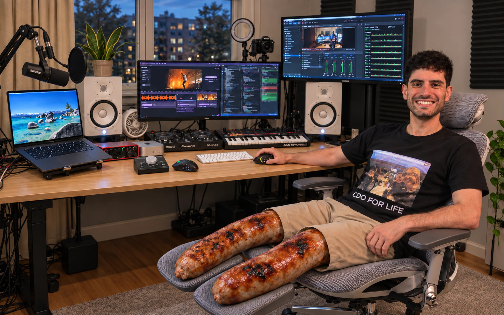

# [Ethan’s setup ↗](https://ethansk.github.io/ethan-setup/)

[GitHub](https://github.com/EthanSK) · [Agentic Mouse](https://ethansk.github.io/agentic-mouse/) · [LinkedIn](https://www.linkedin.com/in/ethansk/)

My desk, apps and mouse controls for working with agents.



## Review code without moving your hand

I use twelve thumb controls mirrored across a right-handed Corsair and a left-handed Razer. High sensitivity keeps hand movement small; I can switch hands or occasionally use both to work through a review faster.

In Better Git VS Code, a quick press of button **5 or 8** jumps to the previous or next change. Hold for 300 ms and release to stage the current file and jump in that direction.

The button under the scroll wheel starts VoiceInk++ dictation; the YouTube bridge pauses my video while I talk and resumes only a video it paused.

The website lets you try those controls and the app’s HUD without installing anything. All actions stay in the demo.

## Look around

Matching software and skills appear as prominent links at the top of each relevant dialog: Agentic Mouse on both mice, VoiceInk++ for dictation, Better Git VS Code and Response Preferences on the Dell, the public AIMVS dev skill and Better Git on the VS Code walkthrough, and OBS++ / Aitum++ on the recording setup. Each opens its public website, extension listing or repository in a new browser page.

- The room photo fills the window without stretching and starts aligned to the bottom. You can pan across the cropped area, including in the opening view.
- Click the background to zoom in around that point and reveal nearby items, or drag the background or any floating item label to move around. Clicking a label still opens its item; releasing a drag does not open it or zoom again.
- Scroll down to zoom in and up to zoom out. Spread two fingers to zoom in and pinch them together to zoom out; the photo stays under the midpoint of your fingers. You can start on an item label and keep dragging with one finger after lifting the other.
- Click a mouse, screen or hardware label to move closer and open it. Edge arrows point to items outside the view.
- Rotate product models by dragging and scroll down to zoom in or up to zoom out. Use arrow keys to rotate and Home or Reset view to restore the original framing.
- Moving parts animate back and forth: the desk lifts, the chair adjusts, screens tilt and music controls move. Choose an adjustment or pause it; dragging pauses the adjustment for six seconds. Reduced motion starts paused.
- The D6 Pro and red Q2 Mini have separate floating labels below the right speaker, a subtle insert behind my arm, rotatable models and official product photos. The D6 arm adjusts and both heads show their stroke in slow motion.
- Every hardware dialog opens in 3D, with official product photos underneath. Click a thumbnail or use the arrows, scroll the strip to see more, and select **3D** to return to the model.
- Use the floating left/right arrows to switch between nearby desk items without closing the dialog. Hover for the destination; the route keeps related demos beside their hardware and wraps around at either end. The arrows stay centred while the content scrolls.
- Click outside a dialog or press Escape to return to the room and the exact camera position where you started.
- Open the Dell for its rotatable monitor model, specs and product link. The nearby **Codex** hotspot opens the interactive desktop, Dock, menu bar and Codex example. Samsung opens its monitor product; the separate **OBS** hotspot opens the silent recording demo and my setup details.
- The separate **VS Code** hotspot on the right half of the Dell opens a four-slide walkthrough of my AIMVS workflow: one worktree per agent task, an isolated dev stack per worktree, review with Better Git, and the one message that lands it. Use the numbered slide tabs, the named previous/next buttons below the slide, or arrow keys on the tabs; each slide links to the matching reference in the public AIMVS dev skill. The worktree and file names on the slides are illustrative examples.
- The separate **Stats Widget** hotspot by the MacBook opens my seven-widget layout for Claude and four ChatGPT logins, with setup steps and a link to the public app. The percentages are examples; labels, sparklines, small text widgets and the configured 30-minute refresh interval reflect my setup. Stats Widget also appears in the Software sidebar and the MacBook, Dell and Codex links.
- The room keeps its hardware labels and separate Codex, VS Code, Stats Widget and OBS hotspots; software links also appear in the sidebar, directory and matching dialogs.
- Open **Everything I use** for hardware, apps, nine public skills, five personal skill descriptions and 19 public projects, ordered roughly from most used to least used within each section. All external links open a separate browser page; my [Portosaurus portfolio](https://portosaurus.github.io/ethansk/) is linked beside the site name and embedded below the project list.
- **View product** appears beside each hardware heading. Models and gallery images report failed loads and offer a retry; a failed model does not hide its official photographs.
- The Scarlett's larger explanation sits beside its model or photo, above the specs; on a narrow screen it moves below the image gallery.

The room is a photograph with a Three.js camera, not a scan of the entire room. 3D views require WebGL 2; product photographs and links remain available if the device cannot create a renderer.

Models render at up to 30 fps with pixel density capped at 1.5, pause when hidden, and load on demand; they have not been tested on every device.

The sausage legs are intentional; their hotspot has a Tesco Finest product link and my joke subtitle. Product models are reference-based illustrations, not manufacturer CAD or dimensionally certified replicas.

## On my desk

| Hardware | My model |
| --- | --- |
| [Corsair Scimitar Elite Wireless SE](https://www.corsair.com/uk/en/p/gaming-mouse/ch-9314415-ww/scimitar-elite-wireless-se-mmo-gaming-mouse-black-yellow-ch-9314415-ww) | Right-handed · 12 thumb buttons · Black / yellow |
| [Razer Naga Left-Handed Edition](https://www.razer.com/gb-en/gaming-mice/razer-naga-left-handed-edition) | Left-handed · 12 mirrored controls · Black |
| [MacBook Pro](https://support.apple.com/en-gb/126319) | 16-inch · M5 Max · 18-core CPU / 40-core GPU · 64 GB unified memory · 2 TB SSD |
| [Yamaha HS8](https://usa.yamaha.com/products/proaudio/speakers/hs_series/) | White pair · 8-inch studio monitors |
| [Focusrite Scarlett 18i8](https://us.focusrite.com/products/scarlett-18i8-3rd-gen) | 3rd generation · 18 inputs / 8 outputs |
| [Pioneer DDJ-FLX4](https://www.pioneerdj.com/en/product/dj-controllers/ddj-flx4/) | Black · 2-channel DJ controller |
| [Mac mini](https://support.apple.com/en-gb/121555) | M4 · 16 GB memory · Silver |
| [Akai MPK mini Plus](https://www.akaipro.com/discover/mpk) | 37 keys · 8 MPC pads |
| [Shure SM7B](https://www.shure.com/en-GB/products/microphones/sm7b) | Dynamic microphone · Dictation and recording |
| [Dell S3422DW](https://www.dell.com/support/home/en-uk/product-support/product/dell-s3422dw-monitor/overview) | 34-inch · 3440 × 1440 · Curved ultrawide |
| [Canon EOS M50 Mark II](https://www.canon.co.uk/cameras/eos-m50-mark-ii/specifications/) | Black · 24.1MP APS-C · EF-M mount |
| [Samsung S80UA](https://www.samsung.com/pt/monitors/high-resolution/s80ua-27-inch-ips-uhd-4k-ls27a800ujpxen/) | 27-inch · 4K · S27A800U |
| [Mackie Big Knob Passive](https://mackie.com/en/products/accessories/big_knob_passive.html) | Passive monitor controller · Volume / mono / mute / dim |
| [WD Elements Desktop](https://www.westerndigital.com/products/external-drives/wd-elements-desktop-usb-3-0-hdd?sku=WDBWLG0140HBK-EESN) | 14 TB · Black · USB 3.0 |
| [FlexiSpot E7 Pro](https://flexispot.co.uk/next-generation-standing-desk-e7-pro) | 2025 model · Bamboo · 180 × 80 cm · Black frame |
| [Bob and Brad D6 Pro](https://www.amazon.co.uk/dp/B0BG56G526) | Black · Adjustable arm and loop handle · 16 mm stroke |
| [Bob and Brad Q2 Mini](https://www.amazon.co.uk/dp/B0BXPGTZLL) | Red · Pocket-sized · USB-C |
| [Hbada E3 Pro](https://www.hbada.uk/products/hbada-e3-pro-ergonomic-office-chair?variant=57072259858807) | 2026 edition · Grey · With footrest |

The Mac mini identifies itself as an M4 with 16 GB memory. The Dell S3422DW identification comes from a July 2026 display inventory; the Samsung currently reports LS27A800U, with its full regional SKU unconfirmed. The Amazon order confirms **14 TB**, despite my initially calling it 12 TB. Product links identify the hardware; availability and offered variants can change. [Source notes](SOURCES.md) explain the evidence and remaining uncertainty.

## Apps and skills

Start with [Agentic Mouse](https://github.com/EthanSK/agentic-mouse), [VoiceInk++](https://ethansk.github.io/VoiceInkPlusPlus/), [Better Git VS Code](https://github.com/EthanSK/better-git-vscode), [Stats Widget](https://ethansk.github.io/stats-widget-from-website/), and [Response Preferences](https://ethansk.github.io/response-preferences/).

The Software sidebar links only public repositories. The full app directory comes from the public [response-preferences desktop inventory](https://ethansk.github.io/response-preferences/desktop/apps.json). The skills section includes the separately published AIMVS dev skill. Ordering is a recent-use snapshot, not live analytics; the [source notes](SOURCES.md) explain its limits.

The OBS dialog also links [Restream Channel Switcher](https://github.com/EthanSK/restream-channel-switcher), which can switch configured groups of Restream destinations from a scene hook.

Each project has its own setup instructions; this repository does not install or configure the native apps.

## Run locally

Requires Python 3.10+ and Node.js 22+ for checks; no npm packages or native app build are needed.

```sh
python3 scripts/build.py
python3 scripts/check.py
node --test tests/*.test.mjs
node scripts/check-model-geometry.mjs
python3 -m http.server 8842 --bind 127.0.0.1 --directory .build/site
```

Open [localhost:8842](http://127.0.0.1:8842/). Keep the server running while using the preview: product models load when opened, so a cached room cannot load them after the server stops. Rebuild after editing `docs/`, then reload the browser. Use the [published website](https://ethansk.github.io/ethan-setup/) for a preview that remains available after closing the terminal. GitHub Pages serves the generated `.build/site` artifact.

## Update the setup

- **Hardware and hotspot positions:** edit `docs/gear.json`; coordinates run from 0 to 1 across the room image. Keep this README’s inventory consistent.
- **Dialog software links:** `relatedTools` in `docs/beta.mjs` defines each public destination and icon; `topicTools` maps desk items and walkthroughs to those links. Keep the manufacturer’s **View product** link separate. Use the project’s own public website or extension listing, or Ethan’s public fork when there is no dedicated site.
- **Room and interactions:** `docs/index.html`, `docs/beta.css` and `docs/beta.mjs`.
- **Room picture:** `docs/assets/room.svg` preserves my selected earlier reference (`c220035`), including its face, shirt, shorts, chair and sausage legs. The existing Tahoe wallpaper stays on the MacBook; only the Dell screen uses `room-dell-legs.webp`, showing AIMVS on the left and VS Code on the right. A separate small `room-massage-guns.webp` patch adds the two massage guns behind my arm; it is clipped clear of my face, arm and screens. This reference predates the Canon patch; the shorter legs and later full-room rebuild are also not applied. Run `python3 scripts/build-room-image.py` after a screen-asset change, then rebuild; never replace the rest of the photo as part of a screen edit.
- **Share preview:** `docs/assets/sausage-legs-social.jpg` is a proportional JPEG export of that same restored composite at 1586 × 992.
- **Site icon:** `docs/assets/ethan-head.png` is the transparent head cutout used for the favicon and home-screen icons. Run `python3 scripts/build-icons.py` with Pillow installed to regenerate the smaller PNG exports; the normal site build uses the committed images.
- **Product geometry:** `docs/product-models.mjs`; geometry and movement references are in [PRODUCT-MODELS.md](PRODUCT-MODELS.md). The MacBook uses the actual Tahoe rocks-and-water wallpaper in `docs/assets/macbook-wallpaper.webp`, cropped proportionally.
- **Product galleries:** `docs/product-gallery.mjs` reads each item's `images` in `docs/gear.json`: local WebP `src`, a concise `angle`, and its official image `source`. Keep images proportional under `docs/assets/products/`, verify the actual model and colour, and document their origin in `SOURCES.md`. The 3D option remains first and is selected again whenever a dialog opens.
- **OBS example and setup details:** `docs/obs.html`, `docs/obs.css` and `docs/obs.mjs`. Keep the dated settings consistent with the [OBS++ setup guide](https://github.com/EthanSK/obs-plus-plus/blob/master/SETUP.md); do not present the example as live telemetry.
- **Stats Widget view:** `#stats-detail` in `docs/index.html` shows an illustrated seven-widget desktop with example percentages; `docs/beta.css` owns its layout. Keep the safe setup summary in [SOURCES.md](SOURCES.md) current without copying account IDs, login profiles, selectors, raw configuration or usage history.
- **VS Code walkthrough:** the slides are static markup under `#vscode-detail` in `docs/index.html`, switched by the small `showSlide` block in `docs/beta.mjs`. Keep the worktree, branch and file names illustrative, keep every link public, and check the ports and rules against the [AIMVS dev skill](https://github.com/EthanSK/aimvs-dev-skill) references the slides link to; the private app repository is never linked. `tests/vscode-walkthrough.test.mjs` checks the slide controls, hotspot placement and link targets.
- **Mouse modes, HUD, mouse models or icon:** change the canonical Agentic Mouse repository, publish it, then run `python3 scripts/sync-sources.py` here. The published native export chooses the source commit; this site does not maintain another button map.
- **Directory order:** `docs/gear.json` and `docs/projects.json` use display order; `appUseOrder` and the combined `skills` list in `docs/beta.mjs` rank apps and skills. Keep the app order here, separate from the synced inventory, so daily source refreshes preserve it. Newly synced apps appear last until ranked; Trash is omitted because it is a desktop action. Public and personal skills share one order.
- **Public project cards:** edit `docs/projects.json` only after verifying each repository is public without authentication. Honest Comments analyzes YouTube criticism; Agent Swarm Management and Agent Bridge are projects, not skills. Personal skills can be described without publishing their local configuration.
- **Desktop, Dock or apps:** change the response-preferences public demo. The Codex hotspot embeds that site directly; the sync script refreshes this site’s app directory.

`sources.lock.json` records the actual source revision and file hashes. A daily GitHub Actions run refreshes the published mouse runtime and app directory, checks the result, saves changes and deploys them. Manual workflow dispatch does the same. Ordinary pushes build the committed snapshot. An upstream refresh that fails checks stops before deployment.

Before pushing a UI change, manually test the final build in Codex’s built-in browser: enter, wheel both ways, drag and release, edge arrows, dialogs, models, both mice, code review, dictation, desktop, the VS Code slides and OBS. Check a narrow mobile viewport, keyboard controls, reduced motion and browser errors. Test actual two-touch pinch when the browser tool supports it; report that check as unverified otherwise. Do not open or focus personal Chrome for testing. Automated checks do not prove visual quality or physical touch behavior. The room gesture tests send two-pointer sequences to the actual camera and input handlers, covering bottom-aligned starting positions, pinch direction and anchoring, labels, release suppression, finger handoff and cancellation; they do not emulate Safari or a phone touchscreen.

For gallery changes, open all 16 hardware dialogs, inspect every photo, return to 3D and rotate it, then reopen to confirm the default. Check thumbnails, previous/next, keyboard navigation and the horizontally scrolling strip in a narrow viewport; confirm both mouse HUDs still respond after returning from a photo.

[AGENTS.md](AGENTS.md) describes ownership and verification requirements for agents. [SOURCES.md](SOURCES.md) covers provenance, privacy and licensing.

## Privacy and reuse

The two external monitors in the main photo show edited versions of my work-screen and OBS captures. Private chats, account details and raw desktop captures are not included. The separate Codex hotspot opens the public desktop example, the Dell opens its product model, the separate VS Code hotspot opens a drawn walkthrough with example worktree names rather than a screenshot, and the separate OBS hotspot opens the OBS example. The OBS and dictation examples do not request microphone, camera or screen-recording access, and do not control the real machine. The embedded public desktop and fonts require a network connection.

Code is MIT licensed; third-party code retains its notices. Ethan’s photographs and likeness, app artwork, manufacturer images and trademarks are not a general-purpose asset pack. Replace them with your own content when adapting this site.

All the wording on this website is AI generated, so sorry if it’s cringe.
